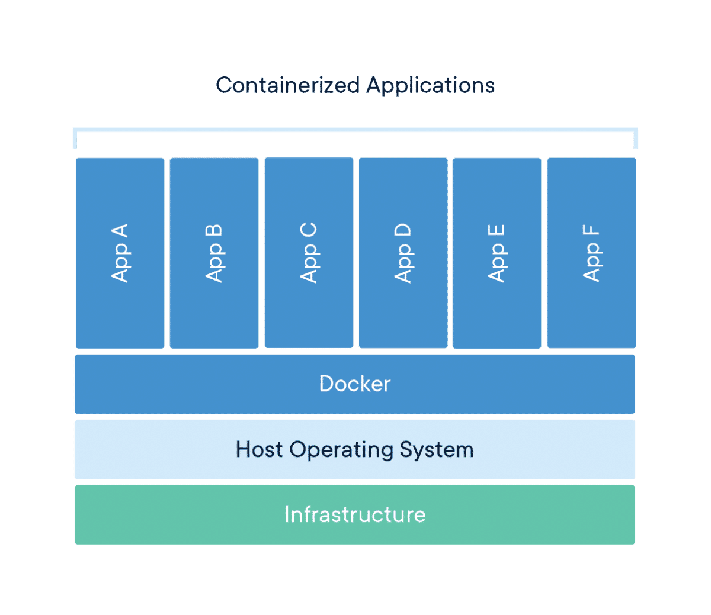

# What is Container
Package Software into Standardized Units for Development, Shipment and Deployment


# VM vs Container
Virtual machines virtualize an entire machine down to the hardware layers and containers only virtualize software layers above the operating system level


# Benifit of cloud service architect  
+ Standardization & productivity
+ Simplicity & faster configurations
+ Rapid Deployment
+ Multi-Cloud Platforms
+ Isolation
+ Security

# How to build and run
```
docker image build -t cloud-native-seminar .
```

```
docker run --rm -p 8080:8080 cloud-native-seminar
```
http://localhost:8080/user

