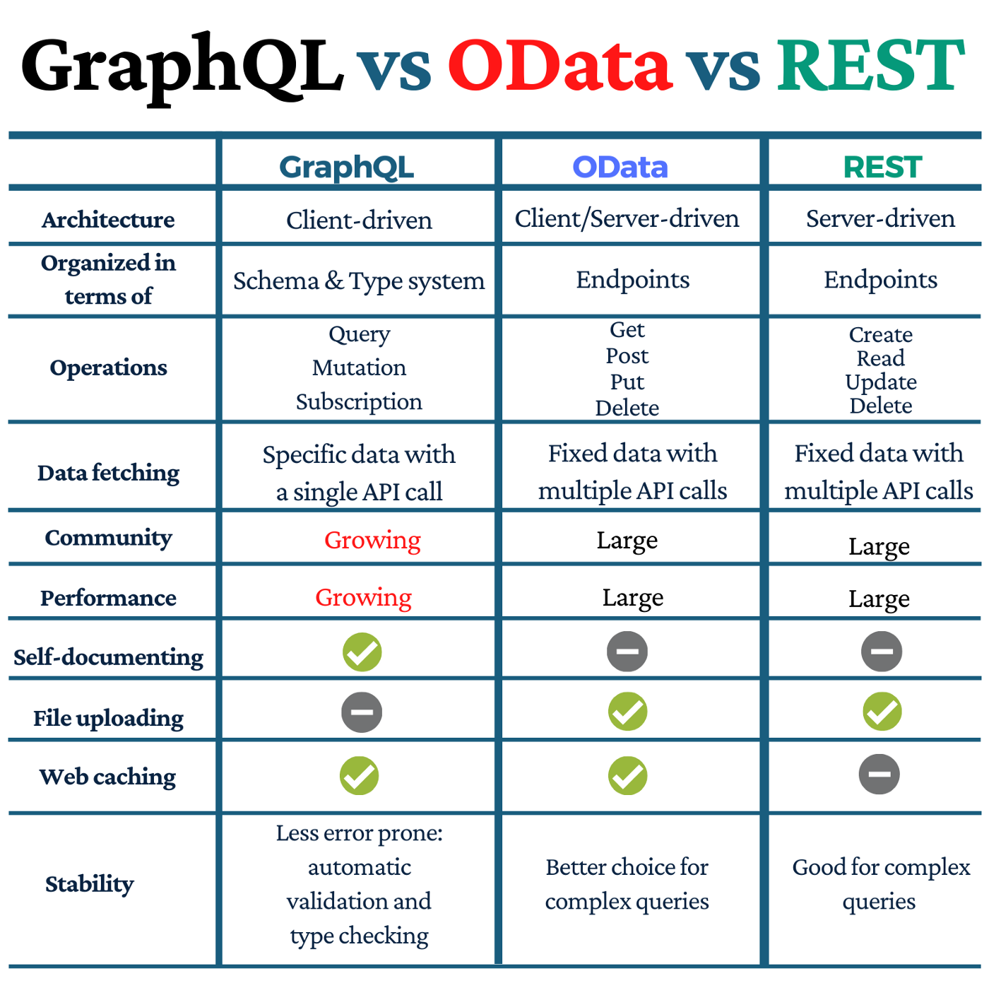

# What is REST(Representational State Transfer)

- provides a HTTP interface for a resource e.g. product
- supports HTTP verbs: POST, GET, PUT, PATCH, DELETE
- provides atomic operations ("all or nothing")
# Guiding Constraints
A system is only RESTful, if it does not violate any of the six guiding constraints.
The most important are:

**Cacheability**: Responses must define themselves as either cacheable or non-cacheable
**Statelessness**: communication is stateless
    - resource state is stored on the server and is sharable to all clients
    - application state is stored on each client and consists of information that cannot be shared.
    - clients are responsible for passing application state to the server when it needs it.

# Syntax of RESTfull
## Get Method
GET Requesting a resource from the server 
query parameters (optional)
```
    GET /user?name=test HTTP/1.1
    Content-Type: application/json
    {"name":"ABC","description":"abc desc"}
```
## Post Method
request line (including HTTP verb and requested resource)
header fields
(optional) message body
```
    POST /user HTTP/1.1
    Content-Type: application/json
    {"name":"ABC","description":"abc desc"}
```

# Other non-REST API

OData (especially in combination with UI5)

GraphQL



# Benifit of cloud service architect  
+ Asynchronous 
+ Multi-Tenancy
+ Programming language independent