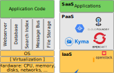
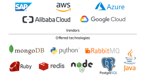
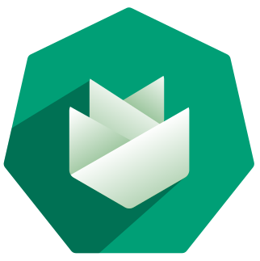
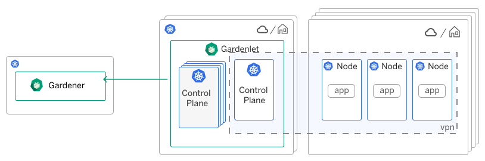

# CICD
CI/CD or CICD is the combined practices of continuous integration (CI) and (more often) continuous delivery or (less often) continuous deployment (CD)

# Cloud Computing Platforms
a category of cloud computing services that provides a platform allowing customers to develop, run, and manage applications without the complexity of building and maintaining the infrastructure

# What is K8s
Containers are a good way to bundle and run your applications. In a production environment, you need to manage the containers that run the applications and ensure that there is no downtime. For example, if a container goes down, another container needs to start.
Kubernetes provides you with a framework to run distributed systems resiliently.

# What is gardener
Deliver fully-managed clusters at scale everywhere with your own Kubernetes-as-a-Service.

Gardener will mangage your k8s cluster across different hyperscalers. Gardener abstracts environment specifics to deliver the same homogeneous Kubernetes-native DevOps experience everywhere

# What is Kyma
Kyma /kee-ma/ is a cloud-native application runtime that combines the power of Kubernetes with a set of best-in-class tools and open-source components that empower you to develop, run, and operate secure and scalable cloud-native applications.

 Kyma will pre-install some tools in the k8s cluster. Its goal is to make developer more focus on business logic not the tools.

