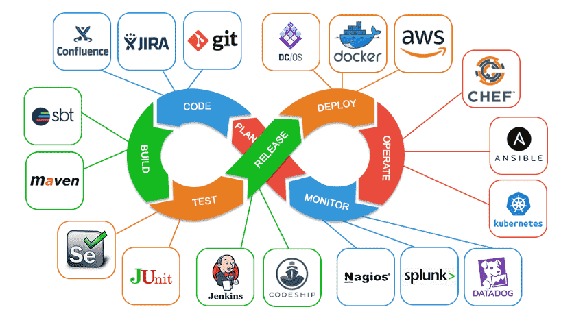

# CICD
CI/CD or CICD is the combined practices of continuous integration (CI) and (more often) continuous delivery or (less often) continuous deployment (CD)



# What is Container
Package Software into Standardized Units for Development, Shipment and Deployment


# VM vs Container
Virtual machines virtualize an entire machine down to the hardware layers and containers only virtualize software layers above the operating system level


# Benifit of cloud service architect  
+ Standardization & productivity
+ Simplicity & faster configurations
+ Rapid Deployment
+ Multi-Cloud Platforms
+ Isolation
+ Security

# What are docker Layers
Layers contain the changes created by a build step, relative to the previous layer in the Dockerfile. FROM instructions are a special case that reference the final layer of an existing image.
```
docker pull php:8.0-apache
8.0-apache: Pulling from library/php
7a6db449b51b: Already exists 
ad2afdb99a9d: Already exists 
dbc5aa907229: Already exists 
82f252ab4ad1: Already exists 
bf5b34fc9894: Already exists 
6161651d3d95: Already exists 
cf2adf296ef1: Already exists 
f0d7c5221e44: Pull complete 
f647198f6316: Pull complete 
c37afe1da4e5: Pull complete 
09c93531cbca: Pull complete 
fef371007dd3: Pull complete 
52043dbb1c06: Pull complete 
Digest: sha256:429889e8f9eac0a806a005b0728a004303b0d49d77b09496d39158707abd6280
Status: Downloaded newer image for php:8.0-apache
docker.io/library/php:8.0-apache
```

# How to build and run locally
```
docker image build -t cloud-native-seminar .
```

```
docker run --rm -p 8080:8080 cloud-native-seminar
```
http://localhost:8080/user

# Push to artifactory
```
docker push licheng5625/cloud-native-seminar
```

https://hub.docker.com/repository/docker/licheng5625/cloud-native-seminar/general